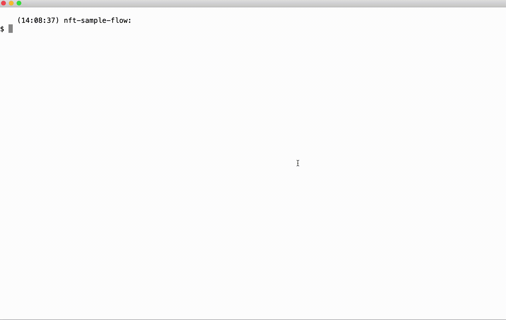

# NFT Sample Flow

A quick sample remove of an NFT with a TSS Server

## Steps to execute NFT

1. Buyer creates claimable balance and gives to seller
2. Seller generates NFT
3. Seller executes smart contract on TSS
4. Seller signs and executes the smart contract transferring ownership to buyer

Note that `txFunctionFee` (the fee to the TSS Server) needs to be occasionally re-created as the TSS takes the fee in batches. To do this, make a payment of 1 or 2 XLM to the TSS public key with the memo holding a hash of the function.

